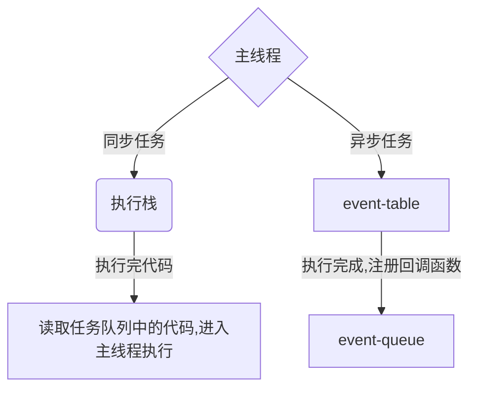

# 事件循环

## javascript事件循环

### 为什么是单线程
> dom操作的原因  
> html5提出web worker标准，允许js创建多个线程，但是子线程完全受主线程控制，且不得操作Dom

### 执行过程

+ event-table中的有微任务队列，宏任务队列
+ event-table中每次事件循环时，执行完本次循环的所有微任务再执行宏任务
+ 事件循环次数为宏任务嵌套层级数
